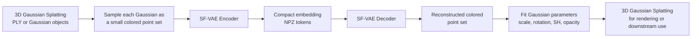

<div align="left">
<h1>Learning Unified Representation of 3D Gaussian Splatting</h1>

[**Yuelin Xin**](https://yuelinxin.github.io/)<sup>1</sup> · [**Yuheng Liu**](https://yuheng.ink/)<sup>1</sup> · [**Xiaohui Xie**](https://xhx.github.io/)<sup>1</sup> · [**Xinke Li**](https://www.cityu.edu.hk/stfprofile/xinkeli.htm)<sup>2</sup>

<sup>1</sup>UC Irvine&emsp;<sup>2</sup>City University of Hong Kong

*International Conference on Learning Representations 2026*

<a href="https://arxiv.org/abs/2509.22917"></a>
<a href="https://cilix-ai.github.io/gs-embedding-page/"></a>

<div>
This repository provides a practical embedding pipeline for 3D Gaussian Splatting, making it easier to convert Gaussian primitives into compact learned features and decode them back for rendering or downstream use. It includes pre-trained checkpoints, training code, data loading utilities, and conversion tools so you can plug 3DGS embeddings into your own reconstruction, generation, compression, or editing workflows without working directly with raw Gaussian parameters. Compared with raw Gaussian parameters, the learned embedding is easier for neural networks to model because it captures the same visual structure in a more consistent and less fragile form. In practice, that means smoother training, faster convergence, better generalization, and a more convenient representation for downstream tasks.
</div>

<div style="width: 100%; text-align: center; margin:auto; margin-top: 1.5em;">
    
</div>

</div>

## News
* **2026-01-27:** Initial code release.

## Setup
Install dependencies:
```bash
pip install -r requirements.txt
```

## Quick Start
### What you need to know to use this codebase
In this codebase, all 3DGS is processed using the `Gaussian` class implemented in `dataset/gaussiangen.py`. You have to use this class to represent 3DGS data in order to run the rest of the codebase directly.

### Conversion Pipeline


### Converting between Embeddings and 3D Gaussian Splatting
You can find some demo code for converting embeddings to 3D Gaussian Splatting format and save it to ply file in the `converter.py` file. You can implement this in your own code that takes in embeddings predicted by another model, and covert them to Gaussian representations. You can import the `Converter` class from `converter.py` to use it for converting embeddings to Gaussians. You will need to load the pre-trained embedding model checkpoint to initialize the `Converter` class. We have provided two 0th order checkpoints (torch compiled):
* `checkpoint_sfvae_sh0.pth`: baseline checkpoint
* `checkpoint_sfvae_sh0_144.pth`: for 4x faster inference with very slightly lower reconstruction quality

You can also run the `converter.py` script directly to convert between embeddings and 3DGS.:
```bash
python converter.py \
    --gaussian2emb \ # or --emb2gaussian
    --src_path <INPUT_PATH> \
    --dist_path <OUTPUT_PATH> 
```

### Loading Data
We implemented several dataset classes in `dataset/ply_data.py` for loading 3DGS data from ply files. You may also find a dataset that loads embeddings data from npz files in the same script. You can use these dataset classes to load your own data in ply (3DGS) or npz (embeddings) format.

### Visualization
In addition, you can also find a 3DGS rendering function called `visualize_gaussian` in the `utils/visualization.py` file, implemented with `gsplat`, which can be used to render a given list of Gaussians. You may also use your own rasterization pipeline such as the original `diff-gaussian-rasterization` codebase.

## Training
Train your own embedding model to reproduce our results:
```bash
python train_embedding.py \
    --model sfvae \
    --dataset gaussiangen \
    --num_points 144 \
    --num_samples 500000 \
    --epoch 1000 \
    --bs 1000 \
    --embedding_dim 32 \
    --norm_weight 0.001 \
    --grid_dim 12 \
    --cuda 0 \
    --weight_path <CHECKPOINT_PATH>
```

Optional: resume from a checkpoint.
```bash
python train_embedding.py --resume True --weight_path <CHECKPOINT_PATH>
```

## Citation
```
@inproceedings{gsembedding2026,
  title={Learning Unified Representation of 3D Gaussian Splatting},
  author={Yuelin Xin and Yuheng Liu and Xiaohui Xie and Xinke Li},
  booktitle={International Conference on Learning Representations},
  year={2026}
}
```

## Contact
For questions or issues, please open a GitHub issue or contact yuelix1@uci.edu

## License
This project is released under the Apache 2.0 License. See `LICENSE` for details.
